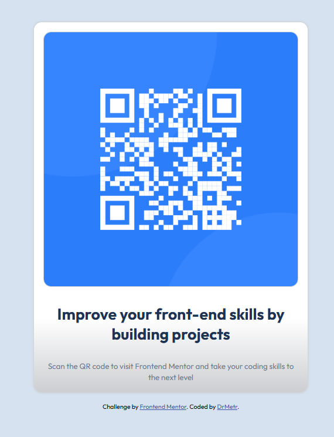

# Frontend Mentor - QR code component solution

This is a solution to the [QR code component challenge on Frontend Mentor](https://www.frontendmentor.io/challenges/qr-code-component-iux_sIO_H). Frontend Mentor challenges help you improve your coding skills by building realistic projects. 

## Table of contents

- [Overview](#overview)
  - [Screenshot](#screenshot)
  - [Links](#links)
- [My process](#my-process)
  - [Built with](#built-with)
  - [What I learned](#what-i-learned)
  - [Continued development](#continued-development)
  - [Useful resources](#useful-resources)
- [Author](#author)
- [Acknowledgments](#acknowledgments)

## Overview

### Screenshot

### Links

- Solution URL: [https://github.com/DrMetr/QR-code-challenge-html-css-animista](https://github.com/DrMetr/QR-code-challenge-html-css-animista)
- Live Site URL: [https://drmetr.github.io/QR-code-challenge-html-css-animista/](https://drmetr.github.io/QR-code-challenge-html-css-animista/)

## My process

### Built with

- Semantic HTML5 markup
- CSS custom properties
- Flexbox
- [Animista](https://animista.net/) - for custom animation

### What I learned

Solving this challenge was supposed to be a training of flexbox property usage. I added a gradient transition and a little animation using Animista CSS library, to my taste.
I had a wide range of solutions of another challenge to peek for tips. Despite that I didn't manage to make the design responsive the way I should have been. 

### Continued development

I plan to take a break at this point and learn JS. I'll be solving challenges here and there.

### Useful resources

- [Animista](https://animista.net/) - great animation library, I liked it.

## Author

- Website - [DrMetr](https://github.com/DrMetr)
- Frontend Mentor - [@DrMetr](https://www.frontendmentor.io/profile/DrMetr)
